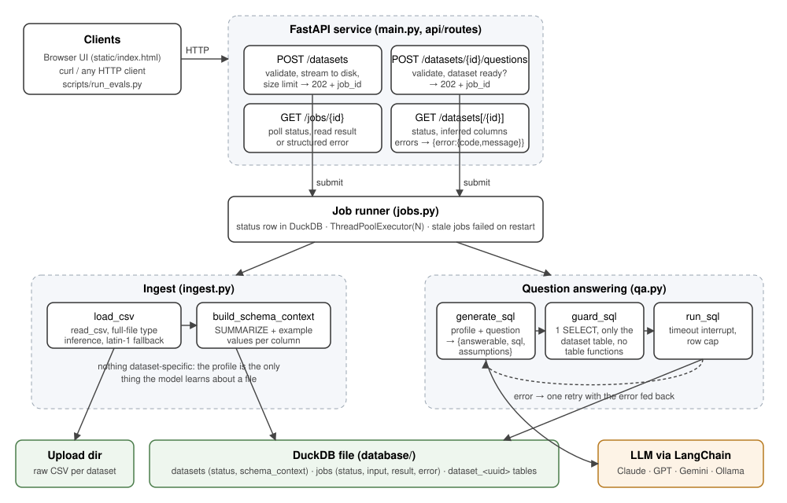

# System design

The system turns a CSV into a DuckDB table and then answers plain-English questions about it. A language model writes one SQL query per question. The application checks that query before running it and returns the rows, the SQL, and the model's stated assumptions, so every number can be traced back to the query that produced it.

## Components and what each owns

| Component | File | Owns |
|---|---|---|
| HTTP API | `main.py`, `api/routes/` | Input validation, status codes, and the error envelope `{"error": {"code", "message"}}`. Unhandled exceptions are logged and returned as a generic 500 with no stack trace. |
| Job runner | `jobs.py` | Job lifecycle (`queued → running → succeeded / failed`), stored in the `jobs` table and run on a fixed-size thread pool. `JobError` separates messages that are safe to show the caller from internal failures. |
| Ingest | `ingest.py` | Loads a CSV into a `dataset_<uuid>` table and builds the **schema context**, a per-column profile computed from the data. |
| Question answering | `qa.py` | The prompt, the model call (through LangChain, any provider), the SQL guard, and query execution with a time limit and a row cap. |
| Storage | `database/` | One DuckDB file that holds the metadata tables (`datasets`, `jobs`) and one table per uploaded dataset. |
| Conversations | `api/routes/conversations.py` | A chat bound to one dataset. Each question is a job tagged with the conversation; its last answered turns become the model's history. |
| UI | `static/index.html` | Chat interface: sidebar of chats, attach or drop a CSV, streamed status, answers with table, assumptions and SQL. One HTML file, no build step, only calls the public API. |

## The path a question takes

In the UI a question is asked inside a conversation (`POST /api/v1/conversations/{id}/questions`). The steps below are the same, except that step 3 also sends the conversation's last six answered turns.

1. `POST /api/v1/datasets/{id}/questions` with `{"question": "..."}`. Pydantic validates the body (3–1000 chars) and the id (must be a UUID). The dataset must exist (404 if not) and be `ready` (409 if not). The request returns **202** with a `job_id` straight away.
2. The job runner picks up the job on a worker thread and sets it to `running`.
3. `generate_sql` sends the model a fixed, dataset-agnostic system prompt, the stored schema context as JSON, and the question. For a follow-up, earlier turns come first as real conversation turns: each question, the model's own plan, and the first 10 rows of its result. That lets "what about France?" resolve against the previous query. The profile is sent once, not once per turn. The model is whatever `LLM_MODEL` names (`anthropic:claude-opus-5-5` by default), created by LangChain's `init_chat_model`. It returns a structured `SqlPlan`: `answerable`, `reason`, `sql`, `explanation`, and `assumptions`. `with_structured_output(method="json_schema")` uses each provider's native JSON-schema output rather than forced tool calls, which some models reject. No JSON is picked out of free text. Provider errors and unparseable output become a clear job failure.
4. If `answerable` is false, the job **succeeds** with `{"answerable": false, "reason": ...}`. A refusal is a correct answer, not an error.
5. `guard_sql` parses the SQL with sqlglot and accepts only a single query statement whose table references are the dataset's own table or its CTEs. That rejects DDL and DML, multiple statements, other tables (including `datasets` and `jobs`), `information_schema`, and table functions such as `read_csv('/etc/passwd')`.
6. `run_sql` runs the query on its own cursor. A timer calls `interrupt()` after `QUERY_TIMEOUT_SECONDS`, and at most `MAX_RESULT_ROWS` rows are fetched.
7. If the guard or DuckDB rejects the query, the model tries again, up to `MAX_SQL_ATTEMPTS` (default 3) attempts in total. Each retry is a real conversation turn that carries **every** earlier failed plan with its error ("Attempt 1 of 3 failed with …"), so the model doesn't repeat a mistake. An exact repeat of a failed query is rejected without running it. The guard regenerates SQL in strict mode, so constructs DuckDB lacks (such as `LIMIT` inside `ARRAY_AGG`) fail with a precise message before anything runs. A timeout is not retried. After the last attempt the job fails with "Could not produce a working query after 3 attempts". The result records `attempts`.
8. The client follows `GET /api/v1/jobs/{job_id}/events`, a Server-Sent Events stream with one event per status change that closes at `succeeded` or `failed`. The worker signals a condition variable on every status write, so the stream wakes on change rather than polling the database. Plain `GET /api/v1/jobs/{job_id}` remains for scripts and curl. The result contains the columns, rows, the SQL as executed, the explanation, and the assumptions.

**Dialect notes.** `prompts/duckdb_notes.md` is appended to the system prompt. It is a checked list of syntax that fails in DuckDB (LIMIT inside aggregates, `TOP`, `DATE_SUB`, `DATEDIFF`, integer `/`, and more) with the DuckDB form to use instead, plus useful idioms (`QUALIFY`, `FILTER`, `GROUP BY ALL`, `TRY_CAST`). When a new failure pattern shows up in the logs, add a row there. No code change is needed.

## How schema context is built from an unfamiliar file

Ingest never looks at column names in code. For each column it records:

- the **type** from DuckDB's CSV sniffer, run over the whole file (`sample_size = -1`) so a late non-numeric value can't break the load;
- the **null percentage**, **approximate distinct count**, **min**, and **max** from one `SUMMARIZE` query;
- **values**: every distinct value when there are 25 or fewer (so the model sees real category labels such as `SALE` / `CANCELLATION`), otherwise the five most common values. Long strings are clipped to 60 characters.

This profile is all the model knows about a file. The system prompt describes the task in general terms and never mentions retail, invoices, or any column. It tells the model to infer meaning from names and example values, to write every interpretation choice into `assumptions`, and to refuse when the data can't support an answer. Min and max are what let it refuse "revenue in 2008" when the dates run from 2010-12 to 2011-11.

### Where it breaks

- **Opaque names.** For columns called `c1, c2, c3`, or codes with no example value that explains them, the model has only types and ranges to go on. It will either guess (visible in `assumptions`) or refuse.
- **Wrong types.** Dates in unusual formats, numbers with thousands separators or currency symbols, and `"N/A"` placeholders are loaded as `VARCHAR`. Queries still run, but they need casts the model may not write.
- **Implicit semantics.** Nothing in a file says that negative quantities are returns, that one row is a line item rather than an order, or which of two amount columns is net. The model infers this from example values, and it can get it wrong. The eval set accepts several interpretations where a reasonable analyst could pick either.
- **Broad questions.** "What is in this file?" is answered from the profile (in the explanation) plus one headline-figures query. The model describes what a row appears to represent, but that description is inferred.
- **Long conversations.** Only the last six answered turns and ten rows of each result go to the model. A follow-up that depends on something older, or on row 50 of an earlier result, loses that context.
- **Very wide files.** The profile grows linearly with the number of columns. A few hundred columns is still fine for the context window, but the per-column queries slow ingest, and too many options make the model's choices worse. The fix is to select the relevant columns first (see What's next).
- **Non-transactional or multi-table data.** Each dataset is one table. Questions that need a join across files are not supported.
- **Messy CSVs.** DuckDB's sniffer handles delimiters, quoting, and headers well, but it can misread a file with a malformed first row. Ingest fails loudly rather than skipping bad rows (`ignore_errors` is off on purpose: losing data silently is worse than an error).

## Biggest decisions and the alternatives I rejected

**1. The model writes SQL, and the application checks and runs it (rather than a semantic layer or letting the model compute answers).**
A semantic layer (predefined metrics such as "revenue" and "customers") gives consistent definitions, but it has to be written for each dataset, and the brief requires answering questions about a CSV the app has never seen with no code changes. Having the model do the arithmetic itself isn't trustworthy. Text-to-SQL keeps the arithmetic in the database, and returning the SQL plus the assumptions makes each answer auditable. The cost is that definitions such as "revenue" can vary between questions; the assumptions list makes that visible rather than hidden.

**2. DuckDB for both the analytical data and the app metadata (rather than Postgres plus a warehouse, or SQLite).**
DuckDB reads CSVs natively with type inference, aggregates 500k rows in milliseconds, and runs in-process, which keeps setup to one command with no extra services. SQLite would need a hand-written loader and is slow for aggregation. Postgres would add a service and still need a loader. The cost is a single writer process, which is why the next decision is shaped the way it is.

**3. In-process job runner with job state in the database (rather than Celery/arq plus Redis, or FastAPI `BackgroundTasks`).**
`BackgroundTasks` has no job id, no status, and no result retrieval. A real queue adds Redis and a worker service, and DuckDB's single-writer model means a separate worker process can't write to the same file. A `ThreadPoolExecutor` with job rows in DuckDB gives submit / poll / result with no extra infrastructure.
*Status delivery:* Server-Sent Events rather than WebSockets. Status only flows from server to client, SSE is plain HTTP (it passes through proxies and reads with curl), and the browser's `EventSource` reconnects on its own. Each open stream holds a worker thread while it waits, which is fine for tens of viewers; hundreds would need an asyncio notifier, and several processes would need Redis pub/sub.
*Under concurrent load:* at most `JOB_WORKERS` jobs run at once and the rest wait as `queued`. API handlers are plain `def` functions running in FastAPI's threadpool, and each database call uses its own cursor, so a long ingest never blocks `/health` or polling. Most question latency is the model call, which releases the GIL.
*Under partial failure:* a failed ingest marks both the job and the dataset `failed` and deletes nothing that was already queryable. A failed question leaves no state behind. If the process dies mid-job, the next startup marks every `queued` or `running` job (and every `ingesting` dataset) as `failed` with "Interrupted by server restart" instead of leaving clients polling forever. Jobs are not replayed automatically. Replaying a question is safe; replaying an ingest would need the idempotency described under What's next.

**4. LangChain as a thin model-agnostic layer (rather than one vendor's SDK or a full agent framework).**
The model is configuration, not code: `LLM_MODEL=openai:gpt-5` or `ollama:llama3.1` switches provider with no code change, and the eval script compares providers on the same questions. LangChain is used only for `init_chat_model` and structured output; the workflow itself (plan, guard, run, retry once) stays in plain Python, so it is testable and bounded to two model calls. Rejected: calling one vendor's SDK directly (simpler, but locks the provider in); a LangChain/LangGraph SQL agent with tools (more flexible exploration, but unbounded calls and harder to test and explain). The cost: provider-specific features (Anthropic's server-side refusal fallback, for example) are not used by default, though `LLM_KWARGS` can pass them through.

**5. Refusal is part of the model's output, backed by structural guards (rather than a separate classifier or a confidence threshold).**
The same call that plans the SQL decides whether the data can answer the question at all, because that decision depends on the same schema context. A separate refusal classifier would duplicate the context and could disagree with the planner. The SQL guard is the second layer: even a confidently wrong plan can only read the one dataset table, for a limited time, returning a limited number of rows.

## Guardrails and evaluation

- **Not inventing answers:** the model never states numbers; every number comes from executed SQL. The response carries the SQL and assumptions. The prompt makes refusal the correct behaviour when data is missing, out of range, needs outside knowledge, or is a forecast.
- **Safety:** SQL allowlist (sqlglot), a query timeout, a row cap, UUID-only identifiers in every interpolated table name, and an upload size limit.
- **Evaluation:** `evals/questions.json` contains five answerable questions (the ones in the brief) and five that should be refused. The expected answers are **reference SQL** written by hand, with one query per defensible interpretation (for example, net vs. sales-only revenue), rather than hard-coded numbers. `scripts/run_evals.py` computes the references from the same CSV, submits all questions concurrently through the public API, and grades them by top values or by numbers within 1%. It exits non-zero if any case fails.
- **Tests (CI):** the parts I'd be nervous about changing, namely the SQL guard, the job lifecycle including restart recovery, ingest edge cases (latin-1, header-only, oversized, empty), and the question flow with the model stubbed (answer, refusal, retry-with-feedback, give-up).

## What I would build next, in order

1. **Answer summary with numbers bound to rows.** Add a one-sentence answer generated from the result rows, and check it by verifying that every number in the sentence appears in the rows.
2. **Clarifying questions for ambiguity.** When the assumptions are material (net vs. gross), return the options instead of choosing one.
3. **Per-dataset glossary / semantic hints.** Let a user pin definitions ("revenue = line_revenue on product lines") that are added to the context. This is the lightweight version of a semantic layer and fits the extensibility story.
4. **Column selection for wide files.** Profile everything, but send the model only the columns relevant to the question, chosen with a cheap first pass.
5. **Cache and observability.** Cache answers keyed on (dataset, normalized question). Log per-job traces covering prompt, plan, SQL, timing, and token cost.
6. **An external queue when scaling beyond one process.** Move ingest to Parquet files so readers and the writer are separated, and run workers on arq or Celery.

## What I cut

- **Authentication and multi-tenancy**: out of scope. Any caller can read any dataset.
- **Deleting datasets and deduplicating uploads.** The raw CSV is also kept after ingest, so data is stored twice.
- **Natural-language answer text** (see step 1 above). The UI shows the table plus the model's explanation.
- **Charts, answer caching, and cost tracking.**
- **Automatic replay of interrupted jobs.**
